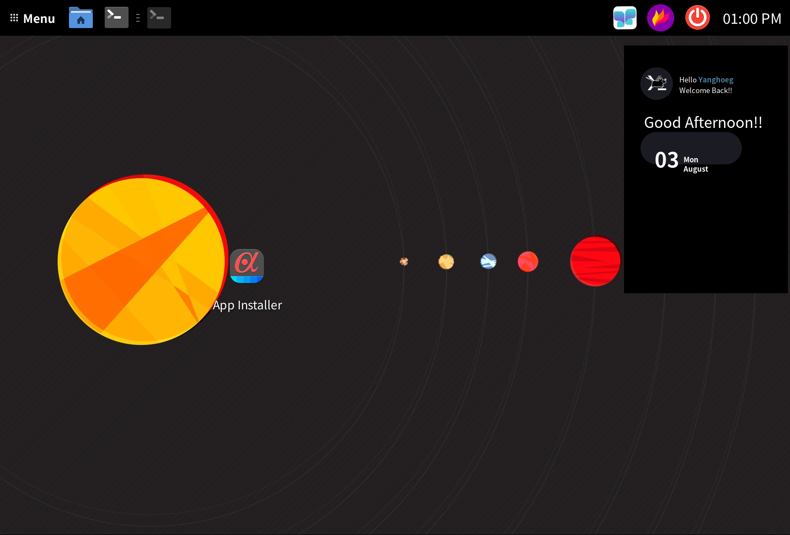

# Termux XFCE

<div align="center">

[한국어](README.ko.md) &nbsp;|&nbsp; **[English](README.md)**

[](https://termux.dev)
[](https://github.com/yanghoeg/Termux_XFCE)
[](LICENSE)



</div>

---

Bash script that automatically installs **XFCE desktop environment** on Termux for Android.  
Derived from [phoenixbyrd/Termux_XFCE](https://github.com/phoenixbyrd/Termux_XFCE).

**Tested devices**: Galaxy Fold6 (Adreno 750, SD 8 Gen3), Galaxy Tab S9 Ultra (Adreno 740, SD 8 Gen2)

## Features

- **Termux native first** — XFCE, Firefox, GPU acceleration all installed as Termux native
- **Optional proot** — Ubuntu / Arch Linux / none
- **Hexagonal Architecture** — distro abstraction keeps Ubuntu & Arch code unified
- **Idempotent** — already installed items are skipped automatically
- **GPU acceleration** — Zink + Turnip auto-activated for Adreno 6xx/7xx/8xx
- **Termux API integration** — Android clipboard sync, battery monitor, brightness/volume control
- **zsh + Powerlevel10k** — set as default shell with autosuggestions & syntax-highlighting

## Installation

> **Just run `install.sh` — every option is asked interactively.**  
> The flags & env vars are only for non-interactive / scripted installs.

```bash
# one-liner (auto clones repo then runs — interactive)
curl -sL https://raw.githubusercontent.com/yanghoeg/Termux_XFCE/main/install.sh | bash
```

```bash
# non-interactive: with options
bash install.sh --distro ubuntu --user <username>
bash install.sh --distro archlinux --user <username>
bash install.sh --no-proot          # Termux native only
bash install.sh --distro archlinux --user <username> --proot-only  # add 2nd distro
```

```bash
# non-interactive: via environment variables
DISTRO=ubuntu USERNAME=<username> bash install.sh
```

| Option | Env var | Description |
|--------|---------|-------------|
| `--distro ubuntu\|archlinux` | `DISTRO=` | proot distro |
| `--user <name>` | `USERNAME=` | proot username |
| `--no-proot` | `SKIP_PROOT=true` | Termux native only |
| `--proot-only` | `PROOT_ONLY=true` | proot only (for adding a 2nd distro) |
| `--display x11\|wayland` | `DISPLAY_SERVER=` | display server (default: `x11`) |

> GPU acceleration, Korean input, and other optional components are managed via `app-installer` after installation.

> ⚠️ **Wayland (labwc) is experimental (under testing).** It has many known issues
> (Korean input, screenshots, etc.), so the default is `x11`. Use `x11` for a stable setup.

## Usage

```bash
startXFCE          # Start XFCE desktop
ubuntu             # Enter Ubuntu proot
archlinux          # Enter Arch Linux proot
prun libreoffice   # Run proot app from Termux terminal
cp2menu            # Copy proot .desktop files to XFCE menu
app-installer      # GUI for installing/removing extra apps
```

## GPU Acceleration

Hardware acceleration via **Zink (OpenGL→Vulkan) + Turnip driver** on Adreno GPUs (Snapdragon 6xx/7xx/8xx).  
Applied automatically to every bash/zsh session after installation.

> **Why glamor alone isn't enough**  
> X11's OpenGL acceleration (`glamor_egl`) requires DRI3 support, but Termux:X11's Xwayland doesn't expose Adreno DRI3.  
> Zink routes OpenGL calls through Vulkan (Turnip) instead, reaching the GPU via `/dev/kgsl-3d0`.

> **If GTK4 apps (zenity, etc.) crash**  
> Fixed by `GSK_RENDERER=cairo` (forces the GTK4 Cairo renderer). Set automatically during install.

```bash
echo $MESA_LOADER_DRIVER_OVERRIDE   # → zink
gpu-info                             # Show GPU model
hud glxgears                         # FPS overlay
```

| Variable | Value | Role |
|----------|-------|------|
| `MESA_LOADER_DRIVER_OVERRIDE` | `zink` | Force OpenGL → Vulkan (Zink) |
| `TU_DEBUG` | `noconform` | Disable Turnip conformance checks |
| `ZINK_DESCRIPTORS` | `lazy` | Optimize descriptor updates |
| `MESA_NO_ERROR` | `1` | Disable GL error checks |
| `MESA_GL_VERSION_OVERRIDE` | `4.6COMPAT` | Advertise OpenGL 4.6 compat |
| `MESA_GLES_VERSION_OVERRIDE` | `3.2` | Advertise GLES 3.2 |
| `MESA_VK_WSI_PRESENT_MODE` | `fifo` | Vulkan present mode (VSync, prevents tearing) |
| `GSK_RENDERER` | `cairo` | GTK4 Cairo renderer (prevents GLX crash) |

> **Note**: If the XFCE4 compositor (xfwm4) causes a black screen,  
> go to Settings → Window Manager Tweaks → Compositor → uncheck "Enable display compositing"

## Termux API Integration

**Termux:API** package and APK are installed automatically. **Termux:Float** APK is also included.

### Auto-enabled

- **Clipboard sync** — Android↔X11 bidirectional clipboard sync daemon starts automatically with XFCE

### Available via App Installer

| Tool | Description |
|------|-------------|
| Conky Battery | Display battery level & temperature in Conky widget |
| Brightness Control | Screen brightness slider for XFCE panel |
| Volume Control | Media volume slider for XFCE panel |
| Notification | Send notifications to Android notification bar |
| TTS Speech | Text-to-speech via Android TTS engine |
| Speech Recognition | Speech-to-text via Android STT engine |
| Wallpaper Sync | Apply XFCE wallpaper to Android home screen |

## Korean Locale (optional)

Displays the XFCE menu/settings/app UI in Korean. Since Termux's bionic libc doesn't support `setlocale(LC_MESSAGES)`, this is worked around via **LD_PRELOAD-based gettext hooking**.

> This approach is implemented based on a method shared by 미코 (Minigi Korea) community member 흡혈귀왕. 🙏

Korean input (fcitx5) and the Korean locale can be installed via `app-installer`.
Korean IME *inside* the proot distro (locale + nimf/fcitx5) is a separate `app-installer` item: `korean_proot`.

| File | Role |
|------|------|
| `assets/force_gettext.c` | gettext hook C source (built with `clang -shared`) |
| `domain/locale_ko.sh` | Places `.mo` catalogs + builds the `.so` |
| `$PREFIX/lib/force_gettext.so` | Runtime-injected shared object |

## App Installer

Install/remove extra apps, system tools, and Termux API tools via a tabbed GUI:

```bash
app-installer          # Full UI (tabs: Apps | System | Termux API | Wine)
app-installer wine     # Wine apps only
```

Headless CLI (no GUI): `bash app-installer/app-install.sh list|install <id>|remove <id>|status <id>`.

- **Tabbed UI** — Apps / System / Termux API / Wine tabs
- **Search** — type to filter by name/description (yad notebook, zenity fallback)
- **Termux native first** — GIMP, Inkscape, Thunderbird install as native
- **proot auto-routing** — LibreOffice, DBeaver, etc. install inside proot

Source: [yanghoeg/App-Installer](https://github.com/yanghoeg/App-Installer) (Git Submodule)

## Shell (zsh + Powerlevel10k)

The installer sets **zsh** as the default shell and configures Powerlevel10k automatically.

```bash
p10k configure        # Reconfigure p10k prompt

# Auto-installed aliases
ll          # eza -alhgF
ls          # eza -lF --icons
cat         # bat
gpu-info    # show Adreno GPU model
zink        # run app with Zink forced
hud         # run app with FPS overlay
```

## What Gets Installed

### Termux Native (always)

| Category | Packages |
|----------|----------|
| Base utils | wget, unzip, dbus, pulseaudio, yad, termux-api, termux-services, xclip |
| XFCE | xfce4, xfce4-goodies, firefox, papirus-icon-theme, termux-x11-nightly |
| CLI | git, zsh, eza, bat, fzf, ripgrep, fd, sd, zoxide, lazygit, gitui, git-delta, difftastic, starship, atuin, zellij, htop, btop, procs, dust, duf, ncdu, yazi, glow, tealdeer, xh, uv, onefetch, jq, fastfetch |
| APKs | Termux:X11, Termux:API, Termux:Float, Termux:Widget, Termux:Boot |

### proot (optional)

| distro | base | entry command |
|--------|------|---------------|
| ubuntu | Ubuntu (proot-distro) | `ubuntu` |
| archlinux | Arch Linux (proot-distro) | `archlinux` |

## Wine — Two Backends

You can choose between two Windows-app backends, and **install both side by side**.

| | Wine (Box64+Staging) | Wine (Hangover) |
|---|---|---|
| Approach | Emulates all of Wine through Box64 | Wine runs native arm64; **only app binaries** go through FEX/ARM64EC |
| Speed | Baseline | Faster |
| Location | inside proot, or glibc-runner | Termux native (no proot needed) |
| Source | Kron4ek/Wine-Builds tarball | Termux x11-repo `hangover` package |
| WINEPREFIX | `$HOME/.wine` | `$HOME/.wine-hangover` |
| Wrapper | `$PREFIX/bin/wine-box64` | `$PREFIX/bin/wine-hangover` |

`wine` on your PATH is a **dispatcher that forwards to the active backend**. Wine apps
(Notepad++, 7-Zip, SumatraPDF, WinMerge) are installed into whichever backend's
WINEPREFIX is active at install time.

```bash
wine-backend              # show active backend + install status
wine-backend hangover     # switch to Hangover
wine-backend box64        # switch to Box64 + Wine-Staging
wine notepad.exe          # run through the active backend
wine-hangover notepad.exe # target a backend explicitly
```

> The WINEPREFIXes are deliberately separate: two different Wine builds (wow64 staging
> vs ARM64EC) sharing one prefix would make `wineboot --update` thrash. After switching
> backends, reinstall the Wine apps you need in that backend.

## Autostart on Boot

`termux-services` (runit) plus the Termux:Boot APK bring services up right after the
device boots.

```bash
sv-enable sshd      # register (starts on boot)
sv-disable sshd     # unregister
sv status sshd      # check
sv up sshd          # start now
```

The installer creates `~/.termux/boot/start-services`, which takes a `termux-wake-lock`
and then starts runit. An existing file is never overwritten.

> Android requires the Termux:Boot app to be **opened at least once** after install
> before it becomes active.

## Tests

```bash
bash tests/run_tests.sh              # main installer suite
bash app-installer/tests/test_domain_apps.sh  # app installer domain
bash tests/run_tests.sh domain_termux
bash tests/run_tests.sh e2e_install
```

Main installer suite: **440** tests across 12 suites (ports 12, adapters 45, adapters_deb 3,
input_interactive 6, domain_termux 76, domain_xfce 47, domain_proot 72, domain_locale_ko 27,
app_installer 85, prun_ld_preload 19, install_matrix 22, e2e_install 26).
The app-installer submodule has its own suites (`test_domain_apps.sh` 154,
`test_adapters.sh` 17, `test_ports.sh` 11, `test_proot_path.sh` 6 — **188** total).

> On Arch these are mock / static checks only — final verification needs a real Termux device.

## Android System Optimization

### Disable Phantom Process Killer (Android 12+)

```bash
adb shell "/system/bin/device_config put activity_manager max_phantom_processes 2147483647"
```

### Disable Battery Optimization

**Android Settings → Apps → Termux** (and Termux:X11) → Battery → **Unrestricted**.

### Wakelock

`termux-wake-lock` is invoked automatically when `startXFCE` runs.

---

## Known Issues

### Termux:X11 — Right-click / Arrow Keys Broken After Switching Apps

Android stops sending key-release events when an app loses focus, causing Alt key to get stuck. ([#781](https://github.com/termux/termux-x11/issues/781))

**Workarounds**: Press Alt once, Super+I to reset input, or use swipe gesture instead of Alt+Tab.

> Samsung DeX: Termux:X11 → Preferences → Keyboard → "Intercept system shortcuts".

---

## Project Structure

```
Termux_XFCE/
├── install.sh                    ← entry point + DI container
├── ports/                        ← contract definitions (interfaces)
├── adapters/
│   ├── input/                    ← CLI args / interactive prompts
│   └── output/                   ← pkg adapters, UI, script builders
├── domain/
│   ├── packages.sh               ← package list definitions
│   ├── termux_env.sh             ← Termux environment (API APKs, clipboard sync)
│   ├── xfce_env.sh               ← XFCE setup
│   ├── proot_env.sh              ← proot logic (Ubuntu/Arch common)
│   └── locale_ko.sh              ← Korean locale (LD_PRELOAD gettext hook)
├── tests/                        ← main installer automated tests
└── app-installer/                ← extra app GUI (Git Submodule)
    ├── install.sh                ← yad notebook tabbed GUI
    └── domain/installers/        ← per-app install scripts (59 apps)
```

## Branch Strategy

| Branch | Purpose |
|--------|---------|
| `main` | Stable — real-device tested, for end users |
| `dev` | In development — merged to main after tests pass |

## Contributing

Bug reports and PRs are welcome via GitHub Issues / Pull Requests.
