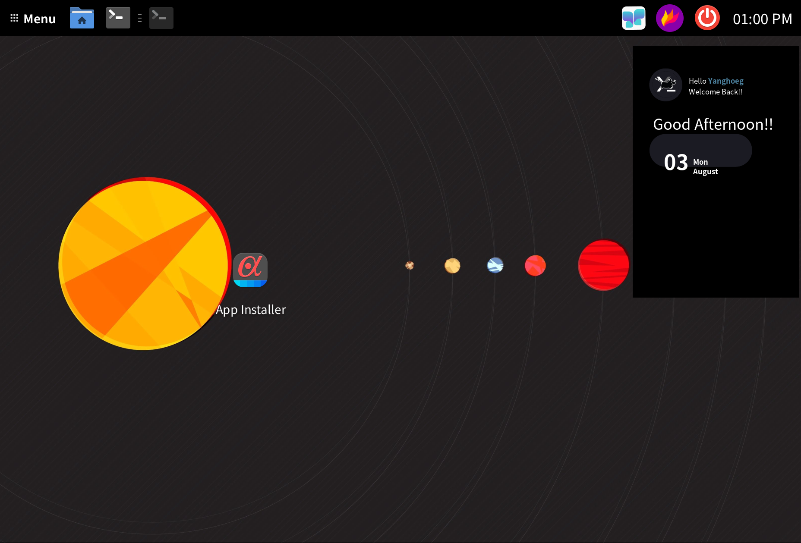

# Termux XFCE

<div align="center">

[한국어](README.ko.md) &nbsp;|&nbsp; **[English](README.md)**

[](https://termux.dev)
[](https://github.com/yanghoeg/Termux_XFCE)
[](LICENSE)



</div>

---

Bash script that automatically installs **XFCE desktop environment** on Termux for Android.  
Derived from [phoenixbyrd/Termux_XFCE](https://github.com/phoenixbyrd/Termux_XFCE).

**Tested devices**: Galaxy Fold6 (Adreno 750, SD 8 Gen3), Galaxy Tab S9 Ultra (Adreno 740, SD 8 Gen2)

## Features

- **Termux native first** — XFCE and Firefox run in Termux; Ubuntu / Arch proot is optional
- **Optional proot** — Ubuntu / Arch Linux / none
- **Hexagonal Architecture** — distro abstraction keeps Ubuntu & Arch code unified
- **Repeatable setup** — installed packages are skipped where possible; managed launchers and settings are refreshed
- **Optional GPU acceleration** — install the drivers with App Installer; the X11 launcher selects Zink + Turnip when available and falls back to software rendering
- **Optional ptrace-free container runtime** — chroot-ng runtime and an Android Host Info Bridge, implemented after the glibc rootfs runtime design by 흡혈귀왕 on meeco.kr ([details](#ptrace-free-runtime-and-host-info-bridge))
- **Termux API integration** — Android clipboard sync, battery monitor, brightness/volume control
- **zsh + Powerlevel10k** — set as default shell with autosuggestions & syntax-highlighting

## Installation

Run in **Android Termux**, with ARM64 (`aarch64`) as the primary target. With no
options, the installer asks for a distro, a proot username when needed, and a display
backend. The default backend is Termux:X11 + XFCE.

```bash
# Download, clone the repository and start interactive setup
curl -sL https://raw.githubusercontent.com/yanghoeg/Termux_XFCE/main/install.sh | bash
```

For a checkout you can also inspect and rerun:

```bash
git clone --recurse-submodules https://github.com/yanghoeg/Termux_XFCE.git
cd Termux_XFCE
bash install.sh
```

An existing clone needs `git submodule update --init --recursive` before installation.
The `app-installer` submodule supplies shared helpers even for native-only setup.
Keep the checkout: the installed `app-installer` command points to it. The one-liner
uses `~/.termux-xfce-installer`.

```bash
# Scripted examples: replace desktop with your proot username
bash install.sh --distro ubuntu --user desktop
bash install.sh --distro archlinux --user desktop
bash install.sh --no-proot
bash install.sh --distro archlinux --user desktop --proot-only

# Equivalent environment variables
DISTRO=ubuntu USERNAME=desktop bash install.sh
```

| Option | Environment variable | Description |
|--------|----------------------|-------------|
| `--distro`, `-d` | `DISTRO=ubuntu` or `archlinux` | proot distro |
| `--user`, `-u` | `USERNAME=desktop` | proot username |
| `--no-proot` | `SKIP_PROOT=true` | Skip proot setup |
| `--proot-only` | `PROOT_ONLY=true` | Configure proot without reinstalling the native desktop |
| `--display` | `DISPLAY_SERVER=x11` or `wayland` | `x11`: XFCE; `wayland`: experimental KDE Plasma |
| — | `PROOT_SHELL=bash` or `zsh` | Interactive proot shell; new configs default to `bash`. Install `zsh` in the container before selecting it |
| `--help`, `-h` | — | Show help |

CLI options override their environment equivalents. Missing distro/user values can
still prompt; supplying flags alone does not guarantee unattended execution.
Usernames must match `[a-z_][a-z0-9_-]{0,31}`. `--no-proot` cannot be combined with
`--proot-only`, `--distro`, or `--user`.

Settings are saved in `~/.config/termux-xfce/config` (mode 600). A `--proot-only` run
preserves the saved display backend and selects the newly configured distro/user for
`prun` and App Installer. An explicit `PROOT_SHELL` overrides the saved shell.
`--no-proot` skips container setup and selects native-only operation by clearing the
saved `PROOT_DISTRO` and `PROOT_USER`. Existing containers remain on disk. To select
one again, rerun with its distro and user, using `--proot-only` if the native desktop
does not need updating.

**Wayland is experimental.** `--display wayland` adds Anland/KWin + KDE Plasma; XFCE
remains installed for X11. This path requires ARM64 Adreno/KGSL hardware. The recorded
Plasma popup and Xwayland failures have not been cleared by device validation of this
installer. Upstream now requires a patched LayerShellQt package that this installer
does not explicitly install. See the [Anland guide](docs/wayland-anland.md) for
[pinned dependencies](docs/wayland-anland.md#pinned-dependencies), APK selection,
and [known blockers](docs/wayland-anland.md#known-blockers).

GPU packages, Korean input and other optional components are managed through App
Installer. Downloaded APKs still require confirmation in Android's installation dialog.

## Usage

```bash
startXFCE             # Start the backend selected at installation: XFCE or Plasma
ubuntu                # Enter Ubuntu proot, if installed
archlinux             # Enter Arch Linux proot, if installed
prun libreoffice      # Run a command in the configured proot distro
PRUN_RUNTIME=chroot-ng prun libreoffice  # Run without ptrace (after installing App Installer `chroot_ng`)
cp2menu               # Import proot .desktop launchers into the native menu
app-installer         # Extra-app GUI
screenshot            # Full screenshot of the current desktop
screenshot region     # Also accepts: full, window
kill_display_session  # Stop the desktop and display server
```

The selected backend also has a `startXFCE-x11` or `startXFCE-wayland` launcher.
Only the launcher for the backend being installed is generated. Run GUI commands
from a terminal in that desktop so they inherit its `DISPLAY`/`WAYLAND_DISPLAY`.
Screenshots use `xfce4-screenshooter` on X11 and `spectacle` on Wayland.

## GPU Acceleration

GPU acceleration is optional. Install `gpu_native` from App Installer for Termux:X11.
`startXFCE` selects Zink + Turnip when it finds both an Adreno GPU and the installed
Turnip ICD; missing support or a detected Zink swapchain failure selects software
rendering. Driver installation does not guarantee acceleration on every Adreno
model. The launcher owns these settings,
so they are no longer forced into every shell. `GSK_RENDERER=cairo` remains the
GTK4 compatibility setting for the X11 session.

For container apps, install `gpu_proot` separately. Distro Turnip builds support only
desktop DRM (msm), so it adds the KGSL Turnip driver from Termux's glibc repository
(pinned version and SHA-256) to the container, keeps the distro's Mesa for Zink, and
enables Zink only after `vulkaninfo` detects Turnip on KGSL. The native Bionic ICD
is not loaded into the container. On Ubuntu 24.04, 25.10 and 26.04 it also places a
pinned [lfdevs](https://github.com/lfdevs/mesa-for-android-container) Mesa build in
`/opt/termux-xfce-mesa`, leaving the distro's Mesa files untouched, and uses its
Freedreno KGSL OpenGL driver instead of Zink. On-screen OpenGL is about ten times faster.
It is enabled only after a display-free EGL check finds the Freedreno renderer; otherwise
OpenGL stays on Zink. Removing `gpu_proot` clears both current and old
installer GPU overrides. Restart running apps after changing this setting.

```bash
gpu-info          # Show the GPU model
glxinfo -B        # Check the renderer from a terminal inside the desktop
hud glxgears      # FPS overlay in the current graphical session
```

Wayland uses the separate Anland/KWin runtime described in
[the Wayland guide](docs/wayland-anland.md).

## ptrace-free Runtime and Host Info Bridge

This was implemented after the "glibc rootfs Linux runtime" work published by 흡혈귀왕 on
meeco.kr. That work covers ptrace-free execution ([06-16](https://meeco.kr/mini/41529519)), an
Android Host Info Bridge with an app checklist ([06-29](https://meeco.kr/ITplus/41603434)), and
Turnip/Zink GPU. The original is not published, so the same structure was built here from open
components.

| Part | Implementation in this repository |
|---|---|
| ptrace-free execution | With `PRUN_RUNTIME=chroot-ng` (env or config), `prun` runs the same proot-distro rootfs through [chroot-ng](https://github.com/sylirre/fake-chroot-ng) (Apache-2.0), built from source by the App Installer item `chroot_ng`. Root tasks such as package installs stay with proot-distro. |
| Android Host Info Bridge | `termux-xfce-hostinfo` rebuilds the blocked `/proc/stat`, `uptime` and `loadavg` from per-core cpuidle and `sysinfo`, and fills device (DMI) and SoC names from getprop. htop, btop, glances, fastfetch and inxi in the guest, and native Termux htop, show real values. |
| GPU | `gpu_proot` adds KGSL Turnip (Vulkan) and Freedreno KGSL (OpenGL, Ubuntu); see [GPU Acceleration](#gpu-acceleration). |
| Big CPU cores | GitHub Termux gets the Termux:X11 sharedUid build (if the regular build is already installed, the installer explains how to switch), so Samsung One UI does not confine Termux apps to small cores while the X11 screen is shown ([termux-x11#1022](https://github.com/termux/termux-x11/issues/1022)). |

Measured on a Galaxy Z Fold6 (SM-F956N):

| Measurement | proot-distro | chroot-ng | Native |
|---|---|---|---|
| `prun true` | 0.6–0.9 s | 0.15 s | — |
| `find /usr` (Ubuntu) | 4–15 s | 0.6 s | — |
| vkmark (headless, xMeM-patched Turnip) | 501 | 4252 | 4004 |

Known limits:
- On this device's Termux:X11, the xMeM-patched Turnip fails to create an X11 swapchain (native Termux Turnip does too), so on-screen Vulkan uses Turnip 24.2.6 and vkcube does not start.
- Network and battery statistics have no source on Android and stay empty.
- Path translation uses only seccomp traps; there is no LD_PRELOAD fast path.
- The guest has no persistent D-Bus session, so GSettings (dconf) changes are not saved. File open and save dialogs work.

## Termux API Integration

The `termux-api` package is installed by the native setup. Termux:API, Termux:Float,
Termux:Widget and Termux:Boot APKs are downloaded and opened for Android installation;
complete each dialog. `--proot-only` skips these steps.

The companion APK URLs in this installer point to GitHub builds. Termux and its
companions must use the same signing source; with F-Droid Termux, install the
matching companions from F-Droid. See the
[Termux installation guide](https://github.com/termux/termux-app#installation).
Anland's standard/compatible selection is separate from these companion APKs.

### Auto-enabled

- **X11 clipboard sync** — a bidirectional Android↔X11 daemon starts with XFCE.
- **Wayland clipboard** — handled by Anland; the X11 polling daemon is not started.

### Available via App Installer

| Tool | Description |
|------|-------------|
| Panel Battery (`api_conky_battery`) | XFCE Generic Monitor script for battery level/temperature; add the panel item manually |
| Brightness Control | Screen brightness slider for XFCE panel |
| Volume Control | Media volume slider for XFCE panel |
| Notification | Send notifications to Android notification bar |
| TTS Speech | Text-to-speech via Android TTS engine |
| Speech Recognition | Speech-to-text via Android STT engine |
| Wallpaper Sync | Apply XFCE wallpaper to Android home screen |

## Korean Locale (optional)

Displays the XFCE menu/settings/app UI in Korean. Since Termux's bionic libc doesn't support `setlocale(LC_MESSAGES)`, this is worked around via **LD_PRELOAD-based gettext hooking**.

> This approach is implemented based on a method shared by 미코 (Minigi Korea) community member 흡혈귀왕. 🙏

Native Korean input (`korean_input` for fcitx5, or `nimf`) and UI localization
(`korean_locale`) are separate App Installer items. A fresh base installation selects
no IME. The native selection is stored in `~/.config/termux-xfce/input-method` and
loaded by `$PREFIX/etc/profile.d/termux-xfce-input.sh`. Installing an IME selects it;
installing another switches the selection. Removing the selected IME clears it,
while rerunning setup migrates an existing selection. Restart XFCE to apply. Wayland clears these X11 IME variables and uses
the Android keyboard through Anland.

The locale installer needs a ZIP containing `ko/LC_MESSAGES/*.mo`; the GUI asks for
it, or the CLI accepts `KOREAN_LOCALE_ZIP=/path/to/locale.zip`. See the
[App Installer guide](app-installer/README.md#korean-input-and-localization).

Proot Korean input (`korean_proot`) installs its own locale and nimf/fcitx5 packages
and writes `/etc/profile.d/termux-xfce-locale.sh` inside the container. `prun` executes
commands through a Bash login shell, which loads the container profiles; interactive
`prun` uses the configured `PROOT_SHELL`.

| File | Role |
|------|------|
| `assets/force_gettext.c` | gettext hook C source (built with `clang -shared`) |
| `domain/locale_ko.sh` | Places `.mo` catalogs + builds the `.so` |
| `$PREFIX/lib/force_gettext.so` | Runtime-injected shared object |

## App Installer

Install/remove extra apps, system tools, and Termux API tools via a tabbed GUI:

```bash
app-installer          # Full UI (tabs: Apps | System | Termux API | Wine)
app-installer wine     # Wine apps only
```

From the Termux_XFCE checkout, the headless CLI supports:

```bash
bash app-installer/app-install.sh list
bash app-installer/app-install.sh list Wine
bash app-installer/app-install.sh install vlc
bash app-installer/app-install.sh status vlc
bash app-installer/app-install.sh remove vlc
```

- **Tabbed UI** — Apps / System / Termux API / Wine tabs
- **Search** — type to filter by name/description (yad notebook, zenity fallback)
- **Termux native first** — GIMP, Inkscape, Thunderbird install as native
- **proot auto-routing** — LibreOffice, VS Code, DBeaver, etc. install inside proot
- **Upgrade** — installed Claude Code, Codex CLI and Notion entries offer *Upgrade*.
  Claude Code targets its pinned version and can restore a backup after a failed
  download or version smoke check; this does not test `/login`. Codex targets its own
  pin without that rollback flow. Notion refreshes its Firefox launcher.

The CLI has no `upgrade` or `rollback` subcommand. App IDs, install targets and
limitations are listed in the [App Installer README](app-installer/README.md).

Source: [yanghoeg/App-Installer](https://github.com/yanghoeg/App-Installer) (Git Submodule)

## Shell (zsh + Powerlevel10k)

The installer sets **zsh** as the default shell and configures Powerlevel10k automatically.

```bash
p10k configure        # Reconfigure p10k prompt

# Auto-installed aliases
ll          # eza -alhgF
ls          # eza -lF --icons
cat         # bat
gpu-info    # show Adreno GPU model
zink        # run app with Zink forced
hud         # run app with FPS overlay
zrunhud     # run proot app with Zink + FPS overlay
```

## What Gets Installed

### Termux Native (except `--proot-only`)

| Category | Packages |
|----------|----------|
| Base utils | wget, unzip, which, ncurses-utils, dbus, pulseaudio, yad, zenity, termux-api, termux-services |
| XFCE | xfce4, xfce4-goodies, firefox, flameshot, papirus-icon-theme, pavucontrol-qt, fontconfig-utils, libuv, libsimdutf |
| Display server | x11: termux-x11-nightly, xdotool, xclip, wmctrl, mesa-demos<br>wayland: Anland 5.13.3, patched KWin/Xwayland/Mesa, pipewire, util-linux, xdotool, xclip, wmctrl |
| Plasma (wayland only) | plasma-workspace, plasma-desktop, kscreen, systemsettings, plasma-integration, plasma-pa, milou, spectacle |
| CLI | git, zsh, eza, bat, fzf, ripgrep, fd, sd, zoxide, lazygit, gitui, git-delta, difftastic, starship, atuin, zellij, htop, procs, dust, duf, ncdu, yazi, glow, tealdeer, xh, uv, onefetch, jq, fastfetch, netcat-openbsd |
| APKs | Termux:X11 (x11) or Anland (wayland), Termux:API, Termux:Float, Termux:Widget, Termux:Boot |

### proot (optional)

| distro | base | entry command |
|--------|------|---------------|
| ubuntu | Ubuntu (proot-distro) | `ubuntu` |
| archlinux | Arch Linux (proot-distro) | `archlinux` |

> `btop`, optional X11/proot GPU packages, Korean input and Wine are App Installer
> items. The base package lists do not require TUR or root-repo. Wayland is the
> exception for graphics: it installs the pinned Mesa/KWin/Xwayland stack itself.

The package lists are maintained in [domain/packages.sh](domain/packages.sh) and
the [X11](adapters/output/display_x11.sh) / [Wayland](adapters/output/display_wayland.sh)
adapters. Proot setup also installs distro-specific utilities and desktop tools,
including Conky, Zenity and Onboard.

## Wine — Two Backends

You can choose between two Windows-app backends, and **install both side by side**.

| | Wine (Box64+Staging) | Wine (Hangover) |
|---|---|---|
| Approach | Emulates all of Wine through Box64 | Wine runs native arm64; **only app binaries** go through FEX/ARM64EC |
| Location | inside proot, or glibc-runner | Termux native (no proot needed) |
| Source | Kron4ek/Wine-Builds tarball | Termux x11-repo `hangover` package |
| Default WINEPREFIX | Proot user’s `$HOME/.wine`, or Termux `$HOME/.wine` without proot | Termux `$HOME/.wine-hangover` |
| Wrapper | `$PREFIX/bin/wine-box64` | `$PREFIX/bin/wine-hangover` |

`wine` on your PATH is a **dispatcher that forwards to the active backend**. Wine apps
(Notepad++, 7-Zip, SumatraPDF, WinMerge) are installed into whichever backend's
WINEPREFIX is active at install time.

```bash
wine-backend              # show active backend + install status
wine-backend hangover     # switch to Hangover
wine-backend box64        # switch to Box64 + Wine-Staging
wine notepad.exe          # run through the active backend
wine-hangover notepad.exe # target a backend explicitly
```

> The default prefixes are separate. Switching backends does not migrate Windows
> apps. Reinstall apps for the selected backend; the installer’s status can still
> reflect a shared launcher from the previous backend. Performance and app
> compatibility depend on the device and workload. See the
> [Wine guide](app-installer/README.md#wine--two-backends).

## Autostart on Boot

`termux-services` (runit) plus the Termux:Boot APK bring services up right after the
device boots.

```bash
pkg install openssh # prerequisite for this example
sv-enable sshd      # register (starts on boot)
sv-disable sshd     # unregister
sv status sshd      # check
sv up sshd          # start now
```

The installer creates `~/.termux/boot/start-services`, which takes a `termux-wake-lock`
and then starts runit. An existing file is never overwritten.

> Android requires the Termux:Boot app to be **opened at least once** after install
> before it becomes active.

## Tests

Run from the Termux_XFCE checkout:

```bash
bash tests/run_tests.sh
bash tests/run_tests.sh install_matrix
bash tests/run_tests.sh display_wayland modern_install
```

The runner is the source of truth for suite names and test counts. Host coverage
includes ports, adapters, domains, generated launchers, input/GPU migrations, install
dispatch and mocked end-to-end flows. Wayland runtime tests execute the supervisor
with mock processes and need Python 3. `force_gettext` builds a normalization harness
with AddressSanitizer and UndefinedBehaviorSanitizer, requiring Clang or GCC with
sanitizer support.

See the [installation matrix guide](tests/INSTALL_MATRIX.md) for coverage and the
boundary between host tests and device installation scripts. App Installer has
[separate test suites](app-installer/README.md#tests) and a
[device verification checklist](app-installer/TEST_LOG.md). Passing host tests does
not establish that installation, graphics, input, audio or authentication work on an
Android device.

## Android System Optimization

### Raise the phantom-process count limit (Android 12+)

Android 12+ can terminate background processes. This command raises the
phantom-process count limit; it does not disable every process-killing policy, and
its effect depends on the Android version and vendor. See the
[Termux Android 12 notice](https://github.com/termux/termux-app#termux-application),
then run from a PC connected over ADB.

```bash
adb shell "/system/bin/device_config put activity_manager max_phantom_processes 2147483647"
```

### Disable Battery Optimization

**Android Settings → Apps → Termux** and the selected display app (Termux:X11 or
Anland) → Battery → **Unrestricted**. Menu names vary by device.

### Wakelock

`termux-wake-lock` is invoked automatically when `startXFCE` runs.

---

## Known Issues

### Termux:X11 — stuck modifiers after switching apps

If mouse clicks or arrow keys stop working after Alt-Tab, release the modifier by
pressing Alt again, or use Android gestures to switch apps. This behavior was
reported in [#781](https://github.com/termux/termux-x11/issues/781); upstream closed it
with the merged [stale-modifier fix](https://github.com/termux/termux-x11/pull/1025).
Check the installed APK version before treating this as an unresolved upstream bug.

For Samsung DeX, also check Termux:X11 → Preferences → Keyboard → **Intercept system
shortcuts**.

---

## Project Structure

```
Termux_XFCE/
├── install.sh                    ← entry point + DI container
├── ports/                        ← contract definitions (interfaces)
├── adapters/
│   ├── input/                    ← CLI args / interactive prompts
│   └── output/                   ← pkg adapters, UI, script builders
├── domain/
│   ├── packages.sh               ← package list definitions
│   ├── termux_env.sh             ← Termux environment (API APKs, clipboard sync)
│   ├── xfce_env.sh               ← XFCE setup
│   ├── proot_env.sh              ← proot logic (Ubuntu/Arch common)
│   └── locale_ko.sh              ← Korean locale (LD_PRELOAD gettext hook)
├── runtime/                      ← Anland session supervisor
├── docs/                         ← Anland setup and limitations
├── tests/                        ← automated tests and installation matrix guide
└── app-installer/                ← extra app GUI (Git Submodule)
    ├── install.sh                ← yad notebook tabbed GUI
    ├── app-install.sh            ← headless list/install/remove/status CLI
    └── domain/installers/        ← per-app handlers (including removal-only entries)
```

## Branch Strategy

| Branch | Purpose |
|--------|---------|
| `main` | Default branch used by the one-line installer |
| `dev` | Development and validation before promotion to `main` |

The parent repository records a specific App Installer submodule commit.
`.gitmodules` names `dev` as its tracking branch; ordinary
`git submodule update --init --recursive` checks out the recorded commit.

## Contributing

Bug reports and PRs are welcome via GitHub Issues / Pull Requests.
